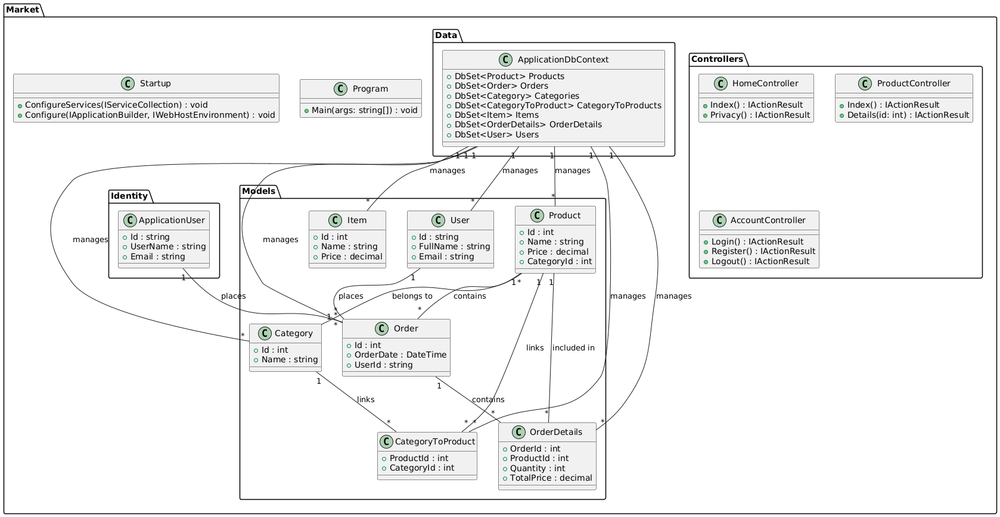

# Market

Market is a practical project developed to learn and apply ASP.NET Core principles, following the Model-View-Controller (MVC) architecture. This e-shop application serves as a foundational step into web development with ASP.NET Core.

## Technologies Used

- **C#**: Primary programming language.
- **ASP.NET Core MVC**: For building the web application.
- **Razor Views**: For dynamic and interactive UI rendering.
- **Entity Framework Core**: Object-Relational Mapping (ORM) tool for database interactions.
- **Microsoft SQL Server Express**: Database management system.
- **Identity Authentication**: Managing user authentication and authorization.

## Project Structure

The solution is organized into several key directories:

- **Components**: Contains reusable UI components.
- **Controllers**: Manages the flow of the application, handling user input and interactions.
- **Data**: Includes data context and configurations for database access.
- **Migrations**: Tracks changes to the database schema over time.
- **Models**: Defines the data structures and business logic.
- **Properties**: Contains project metadata.
- **Views**: Holds the Razor views for rendering the UI.
- **wwwroot**: Static files such as CSS, JavaScript, and images.

## Getting Started

To run this project locally:

1. **Clone the repository**:
   ```bash
   git clone https://github.com/AminGh05/Market.git
   ```
2. **Navigate to the project directory**:
   ```bash
   cd Market
   ```
3. **Restore dependencies**:
   ```bash
   dotnet restore
   ```
4. **Update the database**:
   ```bash
   dotnet ef database update
   ```
5. **Run the application**:
   ```bash
   dotnet run
   ```

Ensure you have [.NET Core SDK](https://dotnet.microsoft.com/download) installed on your machine.

## UML Diagram

Below is the UML diagram representing the project's structure:



## References

This project draws inspiration from:

- [Practical ASP.NET Core course by Iman Madaeny](https://toplearn.com)
- [W3Schools C# Tutorial](https://www.w3schools.com/cs/)
